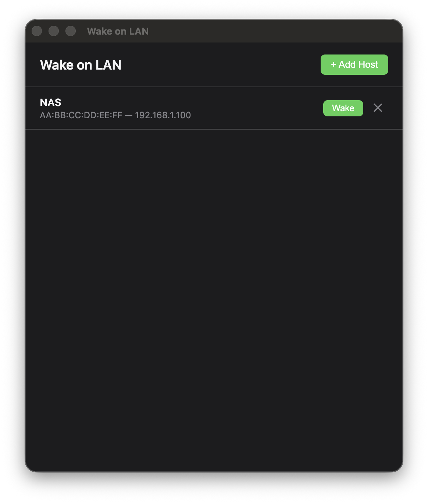

# Wake on LAN

[](https://github.com/matuscvengros/wake-on-lan/actions/workflows/build.yml)
[](https://github.com/matuscvengros/wake-on-lan/actions/workflows/release.yml)
[](https://www.electronjs.org/)
[]()
[](LICENSE)

A simple desktop app to wake computers on your network using [Wake-on-LAN](https://en.wikipedia.org/wiki/Wake-on-LAN) magic packets.

Save your machines once, wake them with a click.



## Install

Download the latest release for your platform:

**[Download from GitHub Releases](https://github.com/matuscvengros/wake-on-lan/releases/latest)**

| Platform | File |
|----------|------|
| macOS (Apple Silicon & Intel) | `.dmg` |
| Windows (x64 & ARM64) | `.exe` |
| Linux (x64 & ARM64) | `.AppImage` |

The app checks for updates on launch and will prompt you when a new version is available.

## Usage

1. Click **+ Add Host**
2. Enter the hostname, MAC address, IP, and broadcast address
3. Click **Save**
4. Click **Wake** to send a magic packet

Click any row to edit. Click **x** to delete.

### Host settings

| Field | Description |
|-------|-------------|
| Hostname | A friendly name (e.g. "NAS", "Gaming PC") |
| MAC Address | Target MAC in `AA:BB:CC:DD:EE:FF` format |
| IP Address | Target machine's IP on your LAN |
| Broadcast Address | Subnet broadcast (e.g. `192.168.1.255`) |
| Port | UDP port, default `9` |
| Send to IP directly | Skip broadcast, send packet straight to the IP |

Host configs are stored in `hosts.json` in the app's data directory:
- **macOS**: `~/Library/Application Support/wake-on-lan/`
- **Windows**: `%APPDATA%/wake-on-lan/`
- **Linux**: `~/.config/wake-on-lan/`

## Prerequisites

For Wake-on-LAN to work, the target machine must:

- Have **WoL enabled in BIOS/UEFI**
- Have **WoL enabled in the OS** network settings
- Be **connected via Ethernet** (Wi-Fi WoL support varies)
- Be on the **same local network** (or have proper routing configured)

## Development

```bash
git clone https://github.com/matuscvengros/wake-on-lan.git
cd wake-on-lan
npm install
npm run dev
```

| Command | Description |
|---------|-------------|
| `npm run dev` | Build and launch the app |
| `npm run build` | Compile TypeScript only |
| `npm run package` | Build distributable for your current platform |

### Project structure

```
src/
├── main/           # Electron main process
│   ├── main.ts     # Window lifecycle
│   ├── ipc.ts      # IPC handlers
│   ├── hosts.ts    # hosts.json persistence
│   ├── wol.ts      # Magic packet (UDP via dgram)
│   └── updater.ts  # Version check against GitHub Releases
├── preload/
│   └── preload.ts  # contextBridge API
├── renderer/
│   ├── index.html
│   ├── styles.css   # System theme (dark/light)
│   └── renderer.ts  # UI logic
└── shared/
    └── types.ts     # Shared TypeScript interfaces
```

## License

MIT
